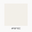
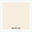
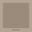

# ANCHOR:23

---

## 1. 🌟 Origen de la Marca

Anchor:23 nace de la unión de **dos creativos** con trayectorias distintas y un criterio común: el lujo no es promesa, es estándar.

La marca surge como respuesta a una ausencia clara en la ciudad: un salón que opere bajo reglas de ultra lujo real, con ejecución constante, acceso limitado y una experiencia coherente en cada detalle.

No es una extensión de otra marca. No es una evolución emocional. Es un concepto paralelo, deliberadamente selectivo.

---

## 2. 🔤 Significado del Nombre

### Anchor

Anchor representa el punto fijo. La base que sostiene y da estabilidad.

En la marca simboliza el estándar bajo el cual se ejecuta cada servicio, decisión y experiencia. No como rigidez, sino como referencia clara.

Es estructura. No ornamento.

### El signo (:)

El signo funciona como una **articulación**.

Ordena el nombre y permite la convivencia de dos criterios creativos dentro de un mismo sistema. No busca significado simbólico ni lectura emocional.

No se explica. No se enfatiza.

Comunica estructura.

### El número 23

El 23 es un **código interno**.

Remite a una idea de dirección, cuidado y constancia entendida de forma cultural y personal, no declarativa. No se presenta como mensaje ni como símbolo explícito.

No se comunica hacia afuera. Opera como fundamento silencioso del concepto.

El cliente no debe entenderlo.

Debe percibirlo en la experiencia: continuidad, calma y seguridad.

---

## 3. 🏷️ Categoría

Belleza de ultra lujo.

Anchor:23 opera como un **concepto exclusivo**, no masivo, con un estándar de servicio que no existe en el mercado local.

---

## 4. 🎯 Propósito

Ofrecer una experiencia estética exclusiva basada en precisión técnica, coherencia visual y ejecución constante.

---

## 5. 👁️ Visión

Ser el referente local de belleza ultra exclusiva, reconocido por su nivel de servicio, selección rigurosa y consistencia impecable.

---

## 6. 🚀 Misión

Operar un concepto de salón de ultra lujo con **una sola sucursal por ciudad**, ajustada al tamaño del mercado, para preservar exclusividad, estándar y coherencia de experiencia.

Anchor:23 no escala por volumen. Escala por selección.

---

## 7. 💎 Valores

* 🌟 Exclusividad — El acceso es limitado por diseño.
* 🏆 Excelencia — El estándar es alto y sostenido.
* 🎯 Selección — Clientes y equipo cumplen criterios claros.
* 🎩 Sobriedad — El lujo se expresa con medida.
* 🔄 Consistencia — La experiencia es siempre la misma.

---

## 8. 🎭 Personalidad de Marca

* 🎩 Sobria
* 📏 Precisa
* 🎯 Selectiva
* 👑 Elegante
* 🔒 Reservada

Anchor:23 no busca agradar a todos.

---

## 9. 🛡️ Arquetipo

**El Curador**

Selecciona, eleva estándares y protege la experiencia.

---

## 10. 🗣️ Voz y Tono

### Voz

* Clara
* Breve
* Profesional

### Tono

* Seguro
* Reservado
* Elegante

Sin adornos. Sin exageraciones.

---

## 11. 🎨 Identidad Visual

### Principios

* 📐 Geometría clara
* ⚖️ Centro de gravedad estable
* 🌫️ Amplio espacio negativo
* 🤫 Composición silenciosa

Nunca gestual. Nunca decorativa.

---

## 12. 🌈 Paleta de Color (GitHub Compatible)

| Swatch                                                       | Nombre         | Hex       |
| ------------------------------------------------------------ | -------------- | --------- |
|                  | Bone White     | `#F6F1EC` |
|                  | Soft Cream     | `#EFE7DE` |
|                | Mocha Taupe    | `#B8A89A` |
|                  | Deep Earth     | `#6F5E4F` |
|          | Charcoal Brown | `#3F362E` |

Uso contenido. Sin saturación. Sin gradientes.

---

## 13. 🔤 Tipografía

### Headings

Serif editorial sobria.

### Texto y UI

Sans neutral.

Mucho aire. Jerarquía estricta.

---

## 14. ✨ Experiencia de Marca

Anchor:23 se vive como:

* 🚫 Acceso limitado
* 👩‍💼 Atención altamente profesional
* 📋 Protocolos definidos
* 🏛️ Ambiente sobrio y refinado

La experiencia no se negocia.

---

## 15. 🌐 Presencia Digital

### anchor23.mx

Sitio institucional. Marca, narrativa y conversión inicial.

### booking.anchor23.mx

Sistema de reservas (The Boutique).

### kiosk.anchor23.mx

Sistema táctil en sucursal (The Kiosk).

---

## 16. 🏢 The HQ (aperture.anchor23.mx)

The HQ, also known as Aperture, is the internal administrative dashboard for management and staff at Anchor:23. It provides a comprehensive view of operations, key metrics, and tools for efficient salon management.

### Key Features
- **Dashboard Home**: Overview with KPIs, top performers, and activity feed.
- **Master Calendar**: Drag & drop calendar with filters for scheduling and resource management.
- **Staff Management**: CRUD operations for staff, commissions, and payroll.
- **Client CRM**: Customer relationship management with loyalty programs (Gold, Black, VIP).
- **Point of Sale (POS)**: Sales processing and cash register closure.
- **Finance and Reports**: Financial management and reporting tools.

The HQ ensures operational excellence, data privacy, and strict control over the exclusive client experience.

---

## 17. 🏛️ Principio Rector

La exclusividad no se declara.

Se demuestra en cada detalle.

---

## 18. 💅 Servicios

Anchor:23 ofrece una gama de experiencias estéticas exclusivas, detalladas en [servicios.md](servicios.md). A continuación, un resumen general por categoría:

### Core Experiences
Experiencias fundamentales centradas en rituales para manos y pies, promoviendo presencia y descanso. Incluye 6 servicios con duraciones de 75-210 minutos y precios entre $1,400 y $3,800 MXN.

### Nail Couture
Enfoque en técnicas invisibles para resultados impecables y naturales. No se ofrecen retoques; todo se integra en la experiencia.

### Hair Finishing Rituals
Rituales de secado y planchado disponibles solo para clientas con experiencia Anchor el mismo día. Incluye 2 servicios con precios de $900 a $1,100 MXN.

### Lash & Brow Rituals
Rituales para definir la mirada con sutileza. Incluye 4 servicios con precios de $1,300 a $2,400 MXN.

### Event Experiences
Experiencias especiales para eventos, incluyendo maquillaje, peinado y paquetes nupciales. Incluye 6 servicios con precios de $1,800 a $8,000+ MXN.

### Permanent Rituals
Rituales permanentes especializados con agenda limitada. Incluye 2 servicios con precios de $7,500 a $8,500 MXN.

Para detalles completos, precios exactos y descripciones, consulta [servicios.md](servicios.md).

---

## 19. 🔗 Links de Prueba

### Frontend Institucional (anchor23.mx)
- https://anchoros.soul23.cloud/ - Landing page con hero, fundamento, servicios y testimoniales.
- https://anchoros.soul23.cloud/servicios - Página de servicios con descripciones.
- https://anchoros.soul23.cloud/historia - Historia y filosofía de la marca.
- https://anchoros.soul23.cloud/contacto - Formulario de contacto.
- https://anchoros.soul23.cloud/franchises - Información de franquicias.
- https://anchoros.soul23.cloud/membresias - Membresías (Gold, Black, VIP).

### The Boutique (booking.anchor23.mx)
- https://anchoros.soul23.cloud/booking/servicios - Selección de servicios y calendario de disponibilidad.
- https://anchoros.soul23.cloud/booking/cita - Flujo de reserva en pasos (búsqueda cliente, confirmación, pago).
- https://anchoros.soul23.cloud/booking/confirmacion - Confirmación de reserva por código.
- https://anchoros.soul23.cloud/booking/registro - Registro de nuevos clientes.
- https://anchoros.soul23.cloud/booking/login - Login con magic links.
- https://anchoros.soul23.cloud/booking/perfil - Perfil de cliente con historial.
- https://anchoros.soul23.cloud/booking/mis-citas - Gestión de citas del cliente.

### The HQ (aperture.anchor23.mx)
- https://anchoros.soul23.cloud/aperture - Dashboard home con KPIs, top performers y feed de actividad.
- https://anchoros.soul23.cloud/aperture/calendar - Calendario maestro con drag & drop y filtros.
- https://anchoros.soul23.cloud/aperture/staff - Gestión de staff (CRUD, comisiones, nómina).
- https://anchoros.soul23.cloud/aperture/clients - CRM de clientes con fidelización.
- https://anchoros.soul23.cloud/aperture/pos - Punto de venta y cierre de caja.
- https://anchoros.soul23.cloud/aperture/finance - Finanzas y reportes.

### The Kiosk (kiosk.anchor23.mx)
- https://anchoros.soul23.cloud/kiosk/[locationId] - Sistema táctil para confirmación de citas y walk-ins.

### Página Centralizada de Test Links
- https://anchoros.soul23.cloud/testlinks - Directorio completo de todas las páginas y APIs del proyecto.

---

## 20. 🖥️ Tecnología y Sistema Operativo

Anchor:23 opera bajo un sistema propietario de gestión diseñado específicamente para estudios de belleza de ultra lujo: AnchorOS. Este motor exclusivo coordina personas, recursos físicos, pagos, privilegios y datos bajo reglas estrictas de control y privacidad.

### Componentes del Sistema AnchorOS
- **anchor23.mx (Frontend Institucional)**: Sitio web público que presenta la marca, servicios, historia y formularios de contacto/franquicias. Gestiona la conversión inicial de visitantes a potenciales clientes.
- **The Boutique (Sistema de Reservas)**: Frontend dedicado a reservas donde los clientes pueden seleccionar servicios, elegir horarios disponibles y completar pagos de depósito. Incluye registro de nuevos clientes y gestión de perfiles.
- **The HQ / Aperture (Backend Administrativo)**: Dashboard interno para gerencia y staff. Incluye calendario maestro con drag & drop, gestión de personal (CRUD, nómina, comisiones), CRM de clientes con fidelización, punto de venta (POS), finanzas y reportes. Proporciona visión completa de operaciones y métricas clave.
- **The Kiosk (Sistema de Autoservicio)**: Interfaces táctiles en sucursales para confirmación de citas existentes y reservas walk-in. Simplifica el proceso operativo sin intervención manual constante.

### Funciones Principales de AnchorOS
- **Gestión Operativa**: Optimización del uso de estaciones físicas y control de crecimiento mediante invitaciones selectivas.
- **CRM Exclusivo**: Protección de la base de datos de clientes con niveles de acceso jerárquicos (VIP, Black, Gold).
- **Sistema de Reservas**: Motor de agendamiento que garantiza rentabilidad en días de alta demanda.
- **Kioskos de Autoservicio**: Facilitan confirmaciones de citas y reservas walk-in en sucursales.
- **Dashboard Administrativo (The HQ)**: Herramientas completas para gestión de staff, finanzas, calendario maestro y fidelización.
- **Integraciones Seguras**: Conexiones con Stripe para pagos, Google Calendar para sincronización y WhatsApp para notificaciones.

El sistema está construido con tecnologías modernas incluyendo Next.js, Supabase y Stripe, asegurando máxima seguridad y eficiencia operativa.

---

Fin del manual de marca Anchor:23.
